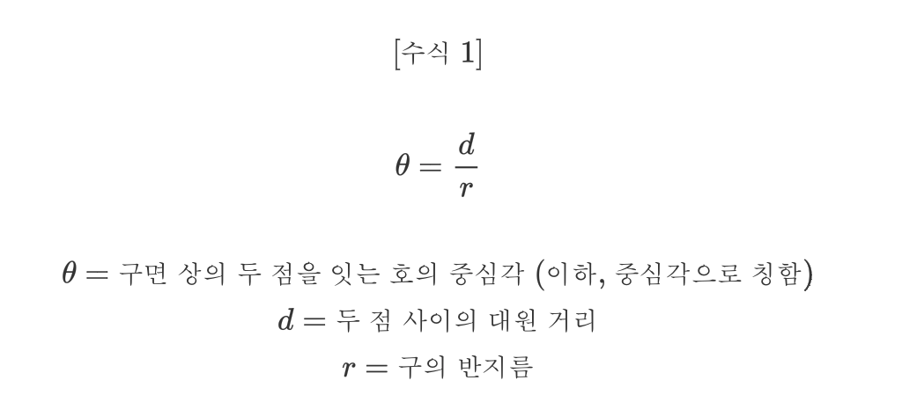
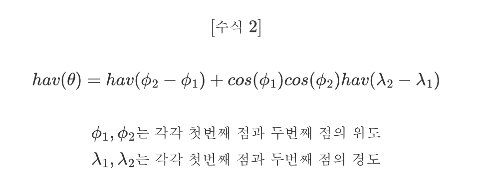
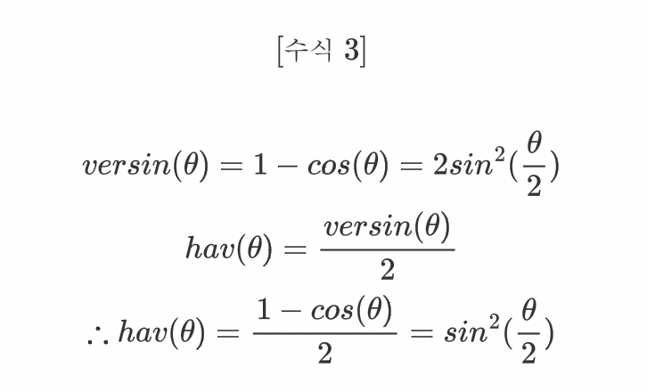
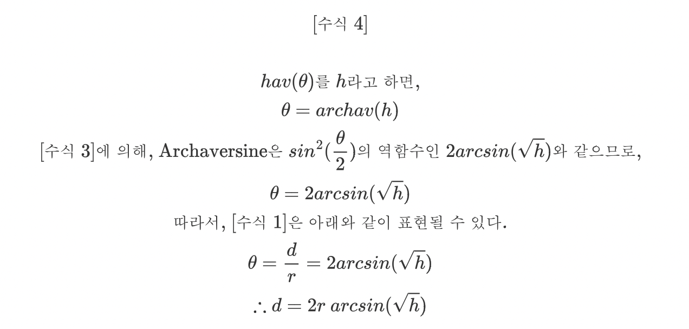
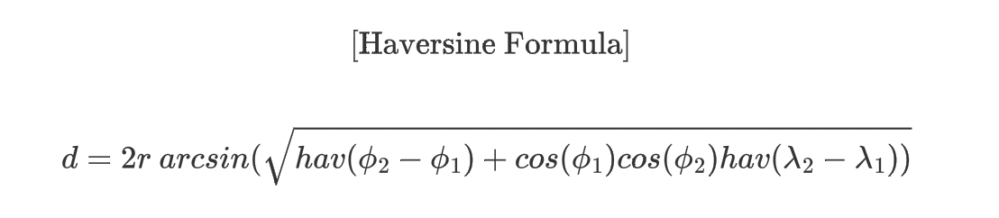
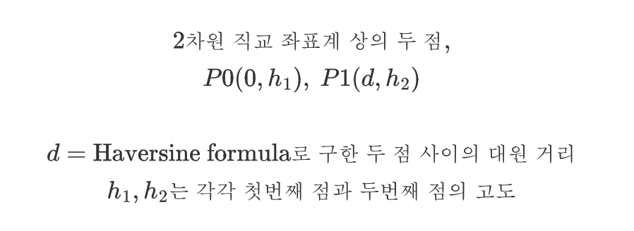
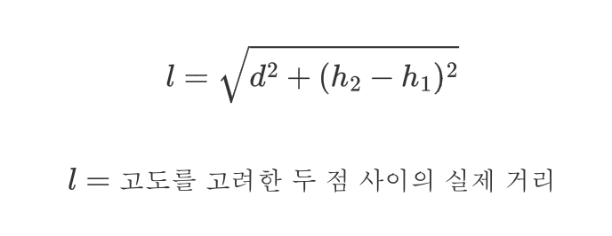
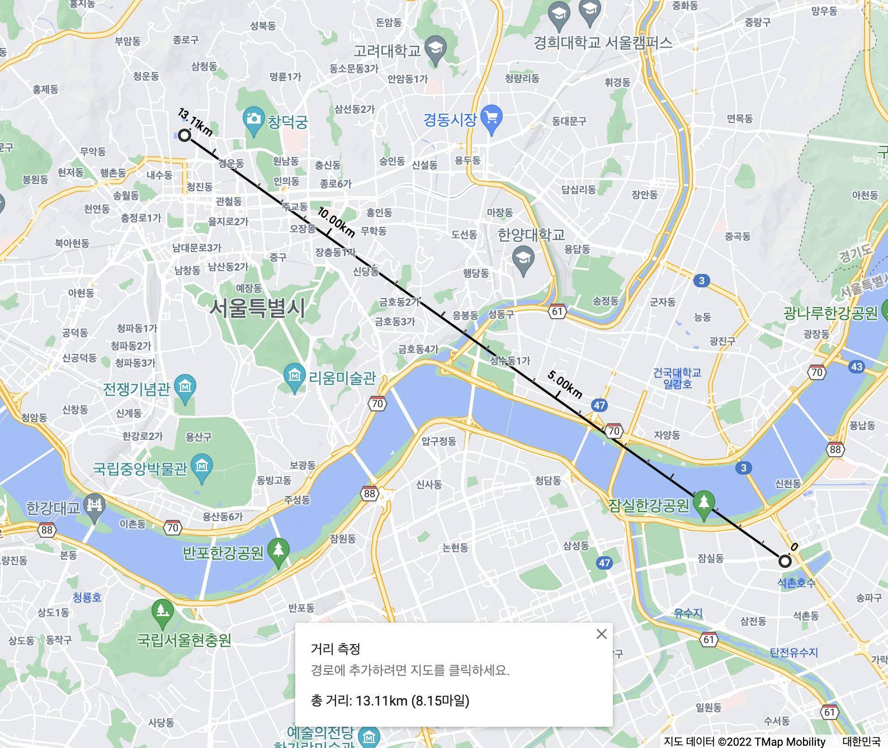
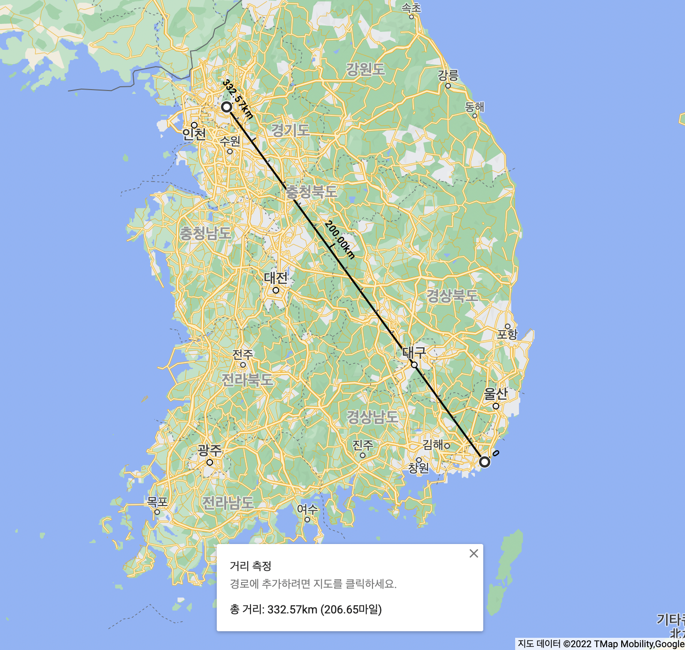
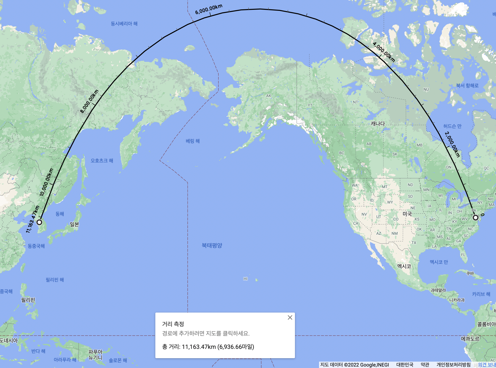

# Haversine Formula

_2022/02/12_

### 개요

* [gourmet-service](https://github.com/Gourmet-Dev/gourmet-service) 프로젝트를 개발하면서 지리 데이터를 건드릴 일이 생겼다.
* Domain(Entity) 클래스에 지리 정보가 포함되게 되어, Geospatial이라는 지리 데이터 클래스를 구현하게 된 것.
* 위도, 경도, 그리고 선택적으로 고도를 통해 기술된 두 위치 사이의 최단 거리를 계산하는 로직이 필요했다.

### 구면에서의 거리 구하기

* 지구는 평면이 아니기 때문에, 단순 사칙연산만으로는 두 점 사이의 최단 거리를 구할 수 없다.
* 구면에서 두 점 사이의 최단 거리를 Greate-circle Distance(이하, 대원 거리)라고 부르는데, 이를 구하면 최단 거리의 근사값을 얻을 수 있다.
* 이를 구하는 방법으로는 [Haversine Formula](https://en.wikipedia.org/wiki/Haversine_formula)라는 공식이 있다.

### Haversine Formula

* 위도와 경도로 기술된, 구면 좌표계 상의 두 점 사이의 대원 거리를 구하는 공식.

* 우선, 호의 중심각에 대한 수식을 보자.
  
  
  
* 다음으로는, 두 점의 위도와 경도로부터 중심각의 Haversine[^1]을 구하는 수식을 보자.

  
  
* Haversine은 그 이름에서 알 수 있듯이 Versine[^2]의 절반을 계산하는 삼각함수이다.

* 그에 따라, Haversine 함수는 아래와 같이도 표현될 수 있다.

  
  
* `[수식 1]` 과 `[수식 3]`을 가지고 중심각의 Haversine으로부터 두 점 사이의 대원거리를 구하는 수식을 만들어보자.

  
  
* 최종적으로 `[수식 4]`의 h에 `[수식 2]`를 대입하면, 두 점의 위도와 경도로부터 대원거리를 구할 수 있게 된다.

  

### 고도를 포함시키기

* 위치 정보에 고도가 포함되어 있는 경우, 이에 대한 거리도 고려해야 한다.

* 처음에는 구면 좌표계와 직교 좌표계 사이를 오가면서 좌표 변환을 해주어야 하나 머리를 싸맸는데... 생각해보니 그럴 필요가 없다.

* 이미 우리는 대원 거리를 구했으므로, 이를 통해 위도, 경도, 고도를 통해 기술된 두 위치를 아래와 같이 표현할 수 있다.

  
  
* 이제, `P0`와 `P1`사이의 유클리디안 거리[^3]를 구하면 된다.

  

### 구현 방법

```kotlin
typealias Degree = Double
typealias Radian = Double
fun Degree.toRadian(): Radian = (this / 180 * PI)
fun Radian.toDegree(): Degree = (this * 180 / PI)

fun haversineFormula(x1: Double, y1: Double, x2: Double, y2: Double): Double {
    val haversineFunction: (Double) -> Double = { radian -> ((1 - cos(radian)) / 2) }
    val earthRadius: Double = 6372.8
    val latDelta = (x2 - x1).toRadian()
    val lonDelta = (y2 - y1).toRadian()
    val latDeltaHav = haversineFunction(latDelta)
    val lonDeltaHav = haversineFunction(lonDelta)
    val sqrtResult = sqrt(
        latDeltaHav +
            cos(x1.toRadian()) *
            cos(x2.toRadian()) *
            lonDeltaHav
    )
    return 2 * earthRadius * asin(sqrtResult)
}

fun haversineWithAltitude(x1: Double, y1: Double, z1: Double, x2: Double, y2: Double, z2: Double): Double {
    return sqrt(haversineFormula(x1, y1, x2, y2).pow(2) + ((z2 / 1000) - (z1 / 1000)).pow(2))
}
```

* Haversine Formula의 모든 각 단위는 라디안 단위임을 명심하자.
* 대다수의 지리 데이터에서 고도는 미터 단위라는 것에 유의하며, 단위 변환을 잘 해주자.
* `earthRadius`값은 지구의 평균 반지름으로, Haversine Formula에서는 지구가 완전한 구라고 가정하고 계산하게 된다.

### 구현 검증

#### 구현 검증 - 가까운 거리

* 경복궁(37.57972629472382, 126.97703995428492)과 롯데월드(37.51132003130456, 127.09819918422973) 사이의 거리를 측정한다.

##### Google Map으로 측정한 거리



##### Haversine Formula로 계산한 거리

* `Haversine Distance: 13.116976136232822`
* 오차: 0.00km

##### 경복궁의 고도를 0km, 롯데월드의 고도를 3km로 설정하고 계산한 거리

* `Altitude Distance: 13.455670290197412`
* 오차: 0.01km

#### 구현 검증 - 도시간 거리

* 경복궁(37.57972629472382, 126.97703995428492)과 해운대(35.158853203095845, 129.16041116961833) 사이의 거리를 측정한다.

##### Google Map으로 측정한 거리



##### Haversine Formula로 계산한 거리

* `Haversine Distance: 332.753056608918`
* 오차: 0.18km

#### 구현 검증 - 대륙간 거리

* 경복궁(37.57972629472382, 126.97703995428492)과 백악관(38.89803328255308, -77.03623996849913) 사이의 거리를 측정한다.

##### Google Map으로 측정한 거리



##### Haversine Formula로 계산한 거리

* `Haversine Distance: 11166.620281224583`
* 오차: 3.15km

### 추가적인 내용

* 아무래도 지구를 완전한 구형으로 가정하고 계산을 하다 보니, 두 점 사이의 거리가 엄청나게 멀 경우에는 유의미한 계산 오차가 발생하게 된다.
* 더 정확한 거리 측정을 위해서는, 회전 타원체 상의 두 점 사이 거리를 계산하는 [Vincenty's formulae](https://en.wikipedia.org/wiki/Vincenty%27s_formulae)[^4]라는 공식을 사용하면 된다.
* 다만, Vincenty's formulae는 Haversine Formula에 비해 계산이 압도적으로 복잡한 것이 단점.
* 일반적인 경우에는 Haversine Formula를 쓰는게 무난하나, 위치가 멀거나 정확도가 중요한 경우에는 Vincenty's formulae를 쓰자.

---

[^1]: 삼각함수의 일종, `hav(x)`와 같이 쓰인다. (상세 설명은 4번 출처, "Versine"을 참고)
[^2]: 삼각함수의 일종, `versin(x)`와 같이 쓰인다. (상세 정보는 4번 출처, "Versine"을 참고)
[^3]: 피타고라스 정리와 같아 보일텐데, 실제로 유클리디안 거리는 피타고라스 정리의 응용이다.
[^4]: 추후, 별도 TIL 문서로 작성 예정.

---

##### References

1. ["Great-circle distance" by "Wikipedia"](https://en.wikipedia.org/wiki/Great-circle_distance)
2. ["Central angle" by "Wikipedia"](https://en.wikipedia.org/wiki/Central_angle)
3. ["Haversine formula" by "Wikipedia"](https://en.wikipedia.org/wiki/Haversine_formula)
4. ["Versine" by "Wikipedia"](https://en.wikipedia.org/wiki/Versine) 
5. ["Euclidean distance" by "Wikipedia"](https://en.wikipedia.org/wiki/Euclidean_distance)
6. ["Vincenty's formulae" by "Wikipedia"](https://en.wikipedia.org/wiki/Vincenty%27s_formulae)

---

