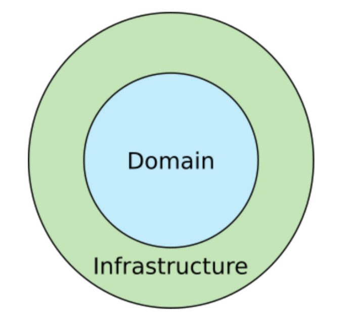
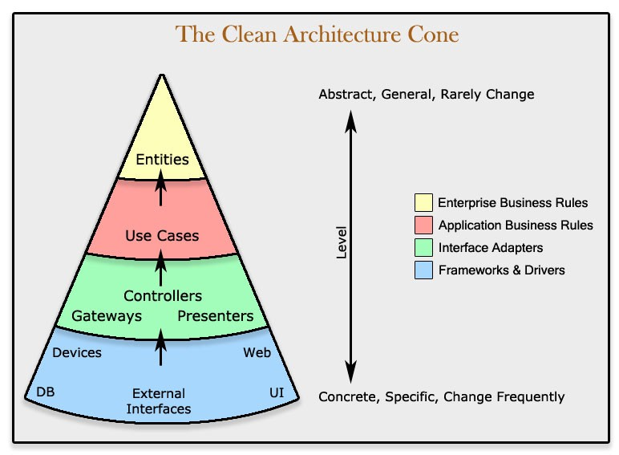
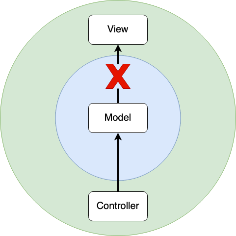
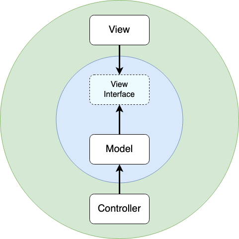

# Clean Architecture by Uncle Bob

_2022/01/18_

### 개요

* Uncle Bob(Robert Cecil Martin)[^1]이 정립한 시스템 아키텍쳐[^2]에 대한 아이디어.
* 기존에 존재하던 시스템 아키텍쳐들의 특징을 파악하고, 이를 하나의 아이디어로 통합하고자 함.

### 기존 시스템 아키텍쳐의 공통점

1. **Independent of Frameworks**: 아키텍쳐는 라이브러리의 존재에 의존하지 않음.
2. **Testable**: 비즈니스 로직은 UI, 데이터베이스 등의 외부 요소 없이도 테스트 할 수 있음.
3. **Independent of UI**: UI와 무관하며, UI는 시스템의 나머지 부분의 변경 없이 쉽게 변경할 수 있음.
4. **Independent of Database**: 데이터베이스도 시스템의 다른 부분과 연관이 없어, 쉽게 변경할 수 있음.
5. **Independent of any external agency**: 비즈니스 로직은 UI나 데이터베이스 등의 외부 세계를 전혀 알지 못하며 영향도 받지 않음.

### 기존 아키텍쳐를 통합한 결과



* 일단은 전체 구조를 2가지로 나누어 보자.
  * Inner Circle = Domain = 정책 = 비즈니스 로직 = 현실 세계를 추상화 = 고수준 = 안정적
  * Outer Circle = Infrastructure = 매커니즘 = 외부 세계 = 구현 세부 사항을 표현 = 저수준 = 가변적
* Inner Circle은 Outer Circle에 대해 아무것도 몰라야(=종속성이 없어야), 안정적이고 가변적인 각 계층의 특성이 지켜짐.
* 이런 식으로 경계를 두어, 관심사를 토대로 각 계층을 분리하여 아키텍쳐를 동작시키게 됨.
* 여기서 가장 기본이 되는 규칙이 **의존성 규칙(Depedency Rule)**.

### 의존성 규칙



* 소스코드의 종속성(=의존성)은 저수준에서 고수준으로, 즉 동심원들의 안쪽 방향으로만 향해야 함.
  * 서점의 책장이 쇠로 만들어졌건 나무로 만들어졌건, 서점이 책을 판다는 본질은 변하지 않음.
  * 동일하게, UI가 웹이건 앱이건, DB가 RDBMS건 NoSQL이건, 시스템의 비즈니스 로직은 변함이 없어야 함.
* 위에 나왔던 2개의 동심원을 특성에 따라 더 쪼개보았음.
  * Domain 계층은 Entities(=Enterprise Business Rules) 계층과 Use Cases(=Application Buisness Rules) 계층으로.
  * Infrastructure 계층은 Adapters(Interface Adapters) 계층과 Infrastructures(=Frameworks & Drivers) 계층으로.

### 각 계층의 상세 구조


#### Entities(=엔티티)

* 전사적 비즈니스 규칙(Enterprise wide business rules)을 담고 있음.

* 외부 변화가 있어도 가장 변경될 가능성이 적고, 가장 고수준(=가장 종속성이 적은) 규칙들을 서술함.

* 현실 세계를 직접적으로 표현한 내용들이 담겨 있으며, 그에 따라 특정 어플리케이션에도 종속되지 않음.

* 코드로 표현할 때는, 정보(=Attribute)와 행위(=Method)를 모두 담아낼 수 있음.

* Kotlin 코드로 예를 들자면, 아래와 같이 책 자체에 대한 정보를 모아둘 수 있을 것.

  ```kotlin
  data class Book(
      val name: String,
      val author: String,
      val ISBN: String,
      val revision: String?,
  ) {
      fun getRevisionName(): String {
          return revision ?: name
      }
  }
  ```

#### Use Cases(=유즈 케이스)

* 어플리케이션 비즈니스 규칙(Application specific business rules)을 담고 있음.
* 시스템의 동작을 사용자의 관점에서 시나리오화 해서, 어플리케이션의 동작을 서술함.
* 엔티티를 참조하고 그와 상호 작용하여 어플리케이션이 이루고자 하는 목적을 달성케 하되, 엔티티 그 자체에 영향을 주어서는 안 됨.
* 당연하겠지만, 사용하는 데이터베이스나 프레임워크가 바뀌더라도 이 단계까지는 변할 필요가 없음.
* 다만, 어플리케이션의 목적이 바뀐다면 이 계층의 구현들은 바뀔 수 있음.

#### Adapters(=어댑터)

* 비즈니스 로직에서 사용되는 데이터 형식과, 데이터베이스 등의 외부 세계에서 사용되는 데이터 형식 사이의 변환 역할을 담당.
* 예를 들자면, Kotlin 데이터 클래스로 관리되던 비즈니스 로직 데이터를 JSON Content-Type을 가지는 HTTP Response로 변환한다던가.
* 어댑터와 연결된 외부 세계가 바뀌더라도, 해당 외부 세계와 연결된 어댑터만 적절하게 바꿔준다면 전체 어플리케이션은 정상 동작 되어야 함.

#### Infrastructures(=인프라스트럭쳐)

* UI / 데이터베이스 / 웹 프레임워크 / 디바이스 / 네트워크 등 모든 외부 세계를 포함.
* 일반적으로, 이 계층에서는 어댑터 등의 내부 계층과 상호 작용하기 위한 결합용 코드 정도만 작성하게 됨.
* 인프라스트럭쳐 자체는 쉽게 변경할 수 있어야 하지만, 그 변경이 어플리케이션의 동작에는 절대 영향을 주어서는 안 됨.

### Clean Architecture의 의미

* 무조건 상술한 4개 계층으로 나누어야 하는 것은 아니다!
  * 시스템 구성에 필요한 구성 요소들을 파악하고, 여러 계층으로 나누기만 하면 된다.
  * 계층을 나누는 기준은 비즈니스 로직에 가까운 지, 프레임워크와 같은 상세 구현에 가까운지 가변성과 추상화 수준을 고려한다.
* 그러나, 각 계층 간의 참조는 한 방향으로만 되어야 한다!
  * A / B / C 순서로 계층이 있다면, `A -> B`와 `B -> C`  혹은 `A -> C`도 가능하지만 `C -> B`나 `C -> A` 는 절대 불가함을 명심하자.
  * 여기서 말하는 불가하다는 개념은, 함수나 클래스를 참조하지 말아야 하는 의미가 아니라 역방향 계층의 존재 자체를 몰라야 한다는 의미!
* 각 계층 간에는 역할과 책임이 명확한 인터페이스를 마련해보자!
  * 계층을 넘나드는 데이터 흐름은, 계층과 계층 간에 대응 관계를 가지는 인터페이스를 통해서만 수행되도록 구조를 고민해보자.

### 의존성 역전에 관한 이야기

* 의존성은 동심원의 밖에서 안으로의 한 방향으로만 진행될 수 있지만, 어플리케이션의 특성에 따라서 제어의 흐름은 반대가 될 수 있음.
* MVC 구조를 가지는 어떤 웹 서비스 시스템이 있다고 예를 들자면...
  * Model은 실제 비즈니스 로직이 들어가는 부분으로, Domain 계층에 해당.
  * Controller는 HTTP Request를 처리하고, View는 UI를 변경하기에 Infrastructure 계층에 해당.
  * 이때, 프로그램의 제어 흐름은 `Controller에서 Request 처리`, `Model에서 비즈니스 로직 수행`, `View에서 UI에 데이터 반영`이 된다.
  * Controller에서 Model로 가는 흐름은 참조가 저수준에서 고수준으로 가기에 Clean Architecture를 위배하지 않음.
  * 근데, Model에서 View에 데이터를 전달하는 흐름은...?
  * 문제 발생!



* 이때, 고수준의 계층에서 필요한 요구 사항만을 명세해놓은 중간 인터페이스를 두는 방식으로 해결할 수 있음.
  * 저수준 계층의 관점에서는, 조금 더 추상화 된 고수준의 인터페이스를 바라보기 때문에 Clean Architecture를 위배하지 않음.
  * 고수준 계층의 관점에서는, 같은 계층의 인터페이스를 바라보기 때문에 이 또한 Clean Architecture를 위배하지 않음.
  * 전체 구조 관점에서도, 고수준의 요구사항 명세와 저수준의 세부 사항이 분리 됨으로서 구현의 변경이 있어도 동작이 바뀌지 않게 됨.




---

[^1]: 객체 지향 설계에서 지켜야 할 5개의 원칙인, SOLID 원칙을 구상해낸 사람이기도 함.
[^2]: 아키텍쳐라는 개념에 대해 쉽게 말하자면, 시스템의 각 구성 요소가 어떻게 나뉘고 어떻게 배치되고 어떻게 상호 작용하는지에 대한 방법론이라고 표현할 수 있음.

---

##### References

* ["The Clean Architecture" by "Uncle Bob"](https://blog.cleancoder.com/uncle-bob/2012/08/13/the-clean-architecture.html)
* ["Clean Architecture 란?" by "국산 앨런"](https://k-elon.tistory.com/38)
* ["Clean Architecture" by "Zedd0202"](https://zeddios.tistory.com/1065)
* ["클린 아키텍쳐의 핵심 아이디어" by "iamchiwon"](https://iamchiwon.github.io/2020/08/27/main-thought-of-clean-architecture/)

---

##### Image References

* [img/architecture_and_design_pattern/Clean_Architecture_Bob_Simplified.png](https://k-elon.tistory.com/38)
* [img/architecture_and_design_pattern/Clean_Architecture_Bob_Cone.jpg](https://zeddios.tistory.com/1065)
* [img/architecture_and_design_pattern/Clean_Architecture_Bob_Overview.jpg](https://blog.cleancoder.com/uncle-bob/2012/08/13/the-clean-architecture.html)