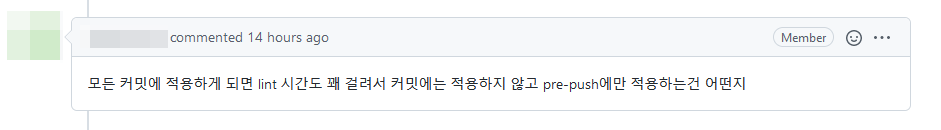

# Kotlin 프로젝트에 린터 도입하기

## 부제: Ktlint와 Detekt 적용기

_2022/02/24_

### 개요

* 최근 여러 사이드 프로젝트를 진행하면서, 협업용 도구에 대해서 관심이 많아지게 되었다.
* 그 중에, 코딩 컨벤션을 준수하는 것은 코드의 가독성 증진에 기여하고 일관된 코드 스타일을 보장한다는 점에서 중요하다.
* 최근 주로 사용하는 언어인 Kotlin은 [공식 코딩 컨벤션](https://kotlinlang.org/docs/reference/coding-conventions.html)이 존재한다.
* 그럼, 이걸 프로젝트에 강제성을 띄는 방향으로 적용해야 하는데...

### 고민

* 강제성을 띄게 하는 방법은 간단하다.
* 린터를 도입해서 자동으로 코드를 검사하고, 코딩 컨벤션에 위배되는 코드는 메인스트림으로 반영하지 못하게 막는 것.
* Github Action과 연동해서 Pull-Request에 대한 검증을 수행하는 방식이 제일 먼저 떠올랐다.
* 그런데, 두 자리수가 넘는 커밋을 포함하는 대규모 PR을 올렸는데 린팅 실패가 나서 전부 Rebase하면서 수정한다...?
* 아무리 생각해도 너무 가혹한 처사가 아닐까 걱정됐다.
* 그래서, 각 커밋을 작성하는 단계에서 린터를 동작시킬 수 있게끔 했다.

### Git Hook

* Git에는 `git` 명령어를 사용하는 특정 상황마다 특정 스크립트를 실행할 수 있게끔 Git Hook이라는 기능을 지원한다.
* `commit-msg` , `pre-push`, `pre-commit` 등등 여러 종류가 있는데, 이름만으로도 어떤 상황에 호출되는지 알 수 있다. 
* 우리는 이 중에서 `pre-commit` 스크립트를 작성하면, 커밋 직전마다 린터를 동작시킬 수 있을 것이다.
* `project/.git/hooks/pre-commit` 경로로 스크립트를 작성하면, 커밋 직전마다 해당 스크립트가 동작함을 기억하자.

### 첫번째 시도: Ktlint 단독 적용

* 프로젝트에 적용할 방법도 찾았겠다, 이제 린터만 정하면 되는데...
* 찾아보니 Kotlin 코딩 스타일 체크에는 [Ktlint](https://ktlint.github.io/)라는 린터가 제일 무난하다고 하더라.
* 그래서 Ktlint를 프로젝트에 적용해보기로 했다.

#### Gradle에 Ktlint 추가

* 가장 먼저 프로젝트에 Ktlint를 추가해주어야 한다.

* 내가 사용하는 빌드 시스템은 Gradle인데, 아래와 같이 Ktlint를 `build.gradle.kts`에 추가해주면 된다.

  ```kotlin
  plugins {
      /* ... */
      id("org.jlleitschuh.gradle.ktlint") version "10.2.1"
  }
  ```
  

* 그리고 Gradle을 새로고침 해준다.
* 이것만 해도 `./gradlew ktlintCheck` 명령어를 통해 Ktlint를 동작하는데는 문제가 없지만...

#### Git Hook에 Ktlint 추가

* Ktlint를 `pre-commit`으로 Git Hook에 추가해야, 우리가 당초 원하던 강제성을 부여할 수 있다.
* 다행히, 자동으로 Git Hook을 추가하는 `./gradlew addKtlintCheckGitPreCommitHook` 명령어가 존재했다.
* 프로젝트의 `README.md`에 Ktlint를 `pre-commit`에 추가 하는 방법을 설명한 가이드를 추가하는 것으로 작업을 끝냈다.

#### Ktlint 동작 확인

* 아래와 같은 코드 블럭이 있다.

  ```kotlin
  companion object {
      fun fromTask(task: Task) = TaskEntity(
        /* ... */
      )
  }
  ```

* 코틀린 공식 코딩 컨벤션에 위배되게끔, 아래와 같이 수정하고 커밋해보자.

  ```kotlin
  companion object { fun fromTask(task: Task) = TaskEntity(
          /* ... */
      )
  }
  ```

* 아래와 같이 Ktlint가 위배된 부분을 잡아준다.

  ```
  Running ktlint over these files:
  src/main/kotlin/com/revimal/test/infra/persistence/entity/TaskEntity.kt
  
  FAILURE: Build failed with an exception.
  
  * What went wrong:
  Execution failed for task ':ktlintMainSourceSetCheck'.
  > A failure occurred while executing org.jlleitschuh.gradle.ktlint.worker.ConsoleReportWorkAction
     > KtLint found code style violations. Please see the following reports:
       - /Users/hhseo/Workspace/test-project/build/reports/ktlint/ktlintMainSourceSetCheck/ktlintMainSourceSetCheck.tx
  ```

### 두번째 시도: Detekt 단독 적용

* 한참 Ktlint를 잘 쓰고 있는데, 프로젝트를 같이 진행하던 안드로이드 개발자 친구가 새로운 제안을 했다.
* "내가 안드로이드 개발할 때는 Ktlint 말고 Detekt라는 친구를 쓰는데, 얘가 생각보다 괜찮더라고."
* 그래서 한번 찾아봤는데, 잠재적 버그도 찾아주고 성능 저하 포인트도 집어주고 하는 정적 분석 도구였다.
* [Detekt](https://detekt.dev/), 괜찮은데?

#### Ktlint에서 Detekt로 변경

* Detekt도 적용 자체는 그리 어렵지 않다.

  ```kotlin
  plugins {
      /* ... */
      id("io.gitlab.arturbosch.detekt") version "1.19.0"
  }
  ```

* 동일하게 `build.gradle.kts`에 플러그인으로 등록해주면 되는데...
* 문제는, 기본으로 설정된 정적 분석 룰이 상당히 만족스럽지 못했다.
* 정작 잡아줬으면 하는 잠재적 버그는 지나치고, 빈 클래스나 잡고 앉아있는 꼴을 보아하니 속이 꽉 막히는 느낌이었다.

#### Detekt 룰 설정

* 이를 해결하기 위해서는, 직접 Detekt의 룰 설정 파일을 yaml로 작성해주어야 한다.

* 아래는 내가 직접 작성한 설정 파일, `detekt.yml`의 시작 부분이다.

  ```yaml
  build:
      maxIssues: 0
  
  config:
      validation: true
      warningsAsErrors: true
  ```

  * **build/maxIssue:** 0이 아닌 경우, 설정된 개수 이상의 문제가 발생되면 더 이상 분석을 하지 않고 빌드를 캔슬한다.

    (나는 모든 문제점을 한번에 처리 하는 걸 선호할 뿐더러, 나중에 언급할 Report 기능과도 연관이 있어 0으로 설정했다.)

  * **config/warningsAsErrors:** 경고도 전부 에러로 간주하여 빌드를 실패시킬지 여부를 결정한다.

* 다음 부분은, 코드 복잡도를 분석하는 룰의 설정 일부이다.

  ```yaml
  complexity:
      active: true
      TooManyFunctions:
          active: true
          thresholdInFiles: 30
          thresholdInClasses: 20
          thresholdInInterfaces: 10
          thresholdInObjects: 20
          thresholdInEnums: 5
          ignoreDeprecated: true
          ignorePrivate: true
          ignoreOverridden: false
  ```

  * **complexity/active:** 코드 복잡도 분석 룰을 켤지를 결정한다.
  * **Complexity/TooManyFunctions:** 함수 개수에 대한 코드 복잡도 분석 룰을 설정한다.
    * **active:** 해당 룰을 사용할지 여부를 결정한다.
    * **thresholdInFiles:** 한 파일에 몇 개까지의 함수를 허용할지 결정한다.
    * **thresholdInClasses:** 클래스에 몇 개까지의 함수를 허용할지 결정한다.
    * **thresholdInInterfaces:** 인터페이스에 몇 개까지의 함수를 허용할지 결정한다.
    * **thresholdInObjects:** 오브젝트에 몇 개까지의 함수를 허용할지 결정한다.
    * **thresholdInEnums:** 열거형에 몇 개까지의 함수를 허용할지 결정한다.
    * **ignoreDeprecated:** `@Deprecated` 어노테이션이 설정된 함수를 카운트에서 제외할지 결정한다.
    * **ignorePrivate:** Priavte 접근 제어자가 설정된 함수를 카운트에서 제외할지 결정한다.
    * **ignoreOverridden:** 상위 클래스의 함수를 오버라이드한 함수를 카운트에서 제외할지 결정한다.

* 이런 식으로 룰 별로 상세하게 원하는 동작을 설정할 수 있다.
* 다른 룰들에 대해서는, [Detekt 공식 가이드 문서](https://detekt.dev/comments.html)에 자세히 설명되어 있다.

#### Detekt 룰 적용

* 위와 같이 룰 설정 파일을 만들고 나면, Detekt의 기본 룰 설정 대신 사용하게끔 설정해주어야 한다.

* 다시 `build.gradle.kts` 파일을 수정해주자.

  ```kotlin
  detekt {
      buildUponDefaultConfig = true
      allRules = false
      config = files("$rootDir/config/detekt.yml")
  }
  ```

  * **buildUponDefaultConfig:** 설정 파일에서 직접 입력한 부분들만, 기본 룰 설정에서 부분적으로 덮어쓸지 결정한다.
  * **allRules:** 현재 사용할 수 있는 모든 룰을 활성화 할지 결정한다.
  * **config:** 설정 파일의 경로를 입력한다.

*  Gradle을 새로고침 하고, `./gradlew detekt` 명령어로 룰 설정이 의도대로 되었는지 확인하자.

#### Ktlint 플러그인 설정

* Detekt 룰 설정까지 이미 다 끝내고 나자, 그제서야 기존 운용하던 Ktlint의 코딩 컨벤션과 충돌이 일어날까 걱정이 되었다.

* '별 문제 없겠지...' 하면서 구글링을 통해 사례를 찾아보고 있었는데, 걱정을 근본적으로 날려줄 수 있는 해결법이 발견됐다!

* Detekt에서 Ktlint를 Wrapping한 [공식 룰](https://detekt.dev/formatting.html)이 존재했고, 그 적용도 매우 간단했다.

* `build.gradle.kts`에 Detekt에서 Ktlint Wrapper를 참조할 수 있게끔 종속성을 잡아준다.

  ```kotlin
  dependencies {
      /* ... */
      detektPlugins("io.gitlab.arturbosch.detekt:detekt-formatting:1.19.0")
  }
  ```

* 그리고 룰 설정 파일로 들어가서, Detekt 자체의 코드 스타일 체커를 끔과 함께 Ktlint Wrapper를 활성화 해준다.

  ```yaml
  formatting:
      active: true
      
  style:
      active: false
  ```

* 진짜로 이게 끝이다!

#### Report 추출 설정

* 일반적으로 정적 분석 도구에는 분석 결과를 요약한 Report 파일을 생성하는 기능이 있다.

* Detekt가 정적 분석 도구를 천명하고 있는 바, 당연히 Report 파일 생성 기능이 있을거라 생각하고 찾아보았다.

  

* 역시나 있었다.

* 심지어, Github Action과 연동할 수 있는 SARIF 포맷의 Report 파일 생성도 지원하고 있었다.

* 룰 설정 파일에 아래와 같은 내용을 추가로 작성해주자.

  ```kotlin
  output-reports:
      active: true
      exclude:
          - 'TxtOutputReport'
          - 'XmlOutputReport'
  ```

  * Detekt는 TXT, HTML, XML, SARIF의 총 4개 포맷으로 리포트 생성을 지원한다.
  * 하지만 내게 필요한 건, 내가 읽기 위해 필요한 HTML Report와 Github Action에 연동하기 위한 SARIF Report 뿐.
  * TXT와 XML은 제외하고 Report를 생성하게 설정했다.

* 이렇게 설정하고 Detekt를 돌리면, 프로젝트의 `build/reports` 디렉토리 밑에 Report 파일 2개가 생성된다.

#### SARIF Report 파일 하나로 합치기

* Report 파일 자체는 잘 생성됐지만, 하나의 사소한 문제가 존재했다.

* 멀티모듈 프로젝트인지라, 각 모듈의 정적 분석 결과 리포트 파일이 각 모듈 경로에 나뉘어서 생성된 것.

* 찾아보니, Detekt에서도 문제점을 인지하고 XML과 SARIF 포맷에 한해 [Report 파일을 합치는 기능](https://detekt.dev/reporting.html)을 만들어 놯더라.

* 또 다시 `build.gradle.kts`로 돌아가서 추가 작업을 해주자.

  ```kotlin
  val reportMerge by tasks.registering(io.gitlab.arturbosch.detekt.report.ReportMergeTask::class) {
      output.set(rootProject.buildDir.resolve("reports/detekt/detekt.sarif"))
  }
  
  /* ... */
  subprojects {
      /* ... */
      tasks {
          /* ... */
          detekt {
              reports {
                  sarif.required.set(true)
              }
          }
      }
      
      plugins.withType<io.gitlab.arturbosch.detekt.DetektPlugin>().configureEach {
          tasks.withType<io.gitlab.arturbosch.detekt.Detekt>().configureEach detekt@{
              finalizedBy(reportMerge)
  
              reportMerge.configure {
                  input.from(this@detekt.sarifReportFile)
              }
          }
      }
  }
  ```

* Gradle을 새로고침 하고 다시 Detekt를 실행시키면, 루트 경로의 `build/reports`에 `detekt.sarif` 파일이 생성된다.

* 열어보면 모든 모듈의 결과가 포함되어 있는, 통합 Report 파일임을 알 수 있다.

#### Git Hook 적용

* 이제 기본 설정은 끝났겠다, Git Hook과 묶으면 완벽할...텐데.

* Detekt는 Ktlint와 같이 자동으로 Git Hook을 등록해주는 명령어가 없다.

* 따라서, Detekt에서 공식 제공하는 [Git Hook 스크립트](https://detekt.dev/git-pre-commit-hook.html)를 직접 Git Hook 경로에 넣고, 퍼미션 설정해주고 해야 하는데...

* 그게 귀찮아서 실행만 시키면 Git Hook 등록을 자동으로 수행하는 Bash 스크립트를 만들었다.

* 우선, 프로젝트 루트 디렉토리 밑에 `script` 하위 디렉토리를 생성한다.

* 해당 디렉토리에, Detekt의 Git Hook 스크립트를 `.detekt_hook_script.orig`라는 파일로 저장한다.

* 그런 뒤, `setup_detekt.sh`와 같은 이름으로 아래 스크립트를 동일 디렉토리에 작성해서 넣어주면 완성.

  ```bash
  #!/usr/bin/env bash
  
  DETEKT_CURRENT_DIR=$( cd -- "$( dirname -- "${BASH_SOURCE[0]}" )" &> /dev/null && pwd )
  DETEKT_TARGET_DIR="$DETEKT_CURRENT_DIR/../.git/hooks"
  DETEKT_TARGET_FILE="$DETEKT_TARGET_DIR/pre-commit"
  DETEKT_HOOK_SCRIPT="$DETEKT_CURRENT_DIR/.detekt_hook_script.orig"
  
  if [[ ! -d "$DETEKT_TARGET_DIR" ]]
  then
      mkdir -p "$DETEKT_SCRIPT_DIR"
  fi
  
  if [[ -f "$DETEKT_TARGET_FILE" ]]
  then
      echo "*************************************************"
      echo "            Detekt integration failed            "
      echo "*************************************************"
      echo "Reason: GIT pre-commit hook is already installed!"
      exit 1
  fi
  
  cat "$DETEKT_HOOK_SCRIPT" > "$DETEKT_TARGET_FILE"
  chmod +x "$DETEKT_TARGET_FILE"
  
  echo "************************************************"
  echo "                Detekt installed                "
  echo "************************************************"
  echo "Install path: $(ls "$DETEKT_TARGET_FILE")"
  ```

* 위 스크립트를 실행하면, 이미 설치된 경우를 제외하고 Detekt를 `pre-commit` Hook으로 등록하게 된다.

#### Detekt 동작 확인

* 일부러 오동작 하는 코드를 만들기 귀찮아서, `TooManyFunctions`룰의 `thresholdInClasses` 값을 1로 바꿨다.

* 그리고 나서 커밋을 시도하자, 아래와 같이 Detekt가 메소드가 1개 보다 많은 클래스를 잡아냈다.

  ```
  Running detekt check...
  
  FAILURE: Build failed with an exception.
  
  * What went wrong:
  Execution failed for task ':app:gourmet-place-api:detekt'.
  > Build failed with 1 weighted issues.
  
  * Try:
  Run with --stacktrace option to get the stack trace. Run with --info or --debug option to get more log output. Run with --scan to get full insights.
  
  * Get more help at https://help.gradle.org
  
  BUILD FAILED in 14s
  Starting a Gradle Daemon (subsequent builds will be faster)
  > Task :detekt NO-SOURCE
  > Task :app:detekt NO-SOURCE
  > Task :common:detekt NO-SOURCE
  > Task :core:detekt NO-SOURCE
  > Task :infra:detekt NO-SOURCE
  
  > Task :app:gourmet-place-api:detekt
  complexity - 20min debt
          TooManyFunctions - 1/1 - [PlaceController] at /Users/hhseo/Workspace/gourmet-service/app/gourmet-place-api/src/main/kotlin/com/gourmet/service/place/api/PlaceController.kt:14:7
  ```

### 세번째 시도: Ktlint와 Detekt의 병용

* Detekt를 적용하고 행복한 사이드 프로젝트 생활을 하고 있던 중, 처음 Detekt를 적용하자고 제안한 친구가 또 의견을 냈다.

  

* 나 또한, 코드 양이 많아지면 매 커밋 정적 분석 도구인 Detekt를 돌리는 건 무리지 않을까 걱정이 됐다.
* 그래서 `pre-commit`은 Ktlint로, `pre-push`는 Detekt로 역할을 분리하여 코드 퀄리티를 관리하기로 결정했다.

#### Detekt에서 코딩 컨벤션 관련 동작 비활성화

* 매 커밋마다 Ktlint를 돌릴거라면, Detekt의 역할은 잠재적 버그에 대한 정적 분석만으로도 충분하지 않을까?
* 그래서, 아래 작업들을 통해 Detekt에서 코딩 컨벤션 관련 동작을 모두 비활성화했다.
  * Detekt 룰 설정에서 `formatting`은 아예 삭제, `style` 은 끈다.
  * `build.gradle.kts`에서 추가했던 Ktlint Wrapper 종속성을 제거하면 끝.

 #### Ktlint와 Detekt를 한꺼번에 Git Hook 등록할 수 있게 스크립트 작성

* Ktlint 설정 자체는 `build.gradle.kts`에서 플러그인 등록 한 줄만 추가하면 되니까 어렵지 않다.

* 하지만, Ktlint와 Detekt를 각각 `pre-commit`과 `pre-push`에 직접 등록하는 건 상당히 귀찮은 일이다.

* 위에서 작성해놓은 Detekt Git Hook 자동 설정 스크립트를 토대로, 모든 걸 처리해주는 스크립트를 만들었다.

  ``` bash
  #!/usr/bin/env bash
  
  LINTER_CURRENT_DIR=$(cd -- "$( dirname -- "${BASH_SOURCE[0]}" )" &> /dev/null && pwd)
  GRADLEW_SCRIPT_PATH="$LINTER_CURRENT_DIR/../gradlew"
  GIT_HOOK_DIR="$LINTER_CURRENT_DIR/../.git/hooks"
  DETEKT_TARGET_FILE="$GIT_HOOK_DIR/pre-push"
  DETEKT_HOOK_SCRIPT="$LINTER_CURRENT_DIR/.detekt_hook_script.orig"
  
  if [[ ! -d "$GIT_HOOK_DIR" ]]
  then
      mkdir -p "$DETEKT_SCRIPT_DIR"
  fi
  
  if [[ -f "$DETEKT_TARGET_FILE" ]]
  then
      echo "*************************************************"
      echo "            Detekt integration failed            "
      echo "*************************************************"
      echo "Reason: GIT pre-commit hook is already installed!"
      exit 1
  fi
  
  eval "$GRADLEW_SCRIPT_PATH addKtlintCheckGitPreCommitHook"
  
  cat "$DETEKT_HOOK_SCRIPT" > "$DETEKT_TARGET_FILE"
  chmod +x "$DETEKT_TARGET_FILE"
  
  echo "************************************************"
  echo "                Linter installed                "
  echo "************************************************"
  echo "Install path: $(ls "$GIT_HOOK_DIR")"
  ```

* 잘 되더라.

### 추가 작업: IntelliJ에 코틀린 공식 코딩 컨벤션 적용하기

* 린터를 도입해놓고 코드 작성 시에 컨벤션을 준수하지 않으면, 매 커밋마다 인덴트 수정 따위로 시간을 낭비하게 될 것이다.

* 다행히도 내가 사용하는 IDE인 IntelliJ IDEA에서는, 프로젝트에 코틀린 공식 코딩 컨벤션을 쉽게 적용할 수 있었다.

* 우선, `gradle/wrapper/gradle-wrapper.properties` 파일에 아래 한 줄을 추가해주자.

  ```properties
  kotlin.code.style=official
  ```

  * IntelliJ IDEA에서는 이 Gradle property를 읽어들여, 프로젝트 설정에 코틀린 공식 코딩 컨벤션을 적용하게 된다.

* 그리고, 프로젝트 루트 디렉토리에 `.editorconfig` 파일을 생성하여 아래와 같이 작성하면 된다.

  ```
  root = true
  
  [*]
  charset = utf-8
  end_of_line = lf
  indent_size = 4
  indent_style = space
  trim_trailing_whitespace = true
  insert_final_newline = true
  max_line_length = 120
  tab_width = 4
  ```

  * `.editorconfig`는 IntelliJ IDEA 외에, VS Code 등의 다른 코드 편집기 및 IDE에서도 동작하는 설정 파일이다.
  * 코딩 컨벤션을 적용하는 것은 아니지만, 환경 별로 다를 수 있는 인코딩/인덴트 설정을 통일해주는 역할을 한다.

---


---

##### References

1. ["Ktlint 코드 스타일 검사" by "cheese10yun"](https://cheese10yun.github.io/ktlint/)
2. ["ktlint로 Kotlin 공식 코딩 컨벤션 맞추기" by "benelog"](https://blog.benelog.net/ktlint.html)
2. ["Getting Started with Gradle" by "Detekt"](https://detekt.dev/gradle.html)